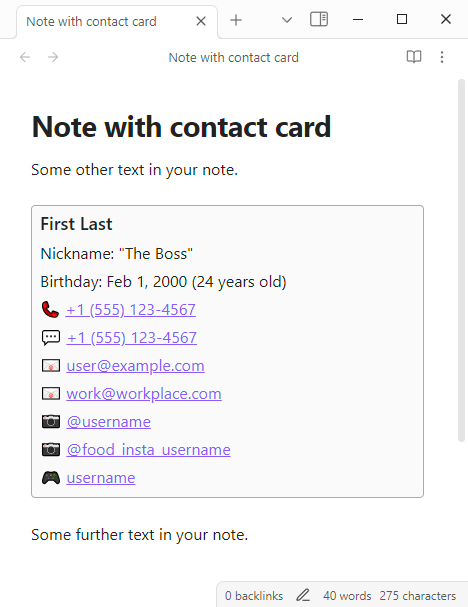

# Beautiful Obsidian Contacts

This is a plugin for Obsidian (https://obsidian.md). It will render a contact card given the data present in a "contact" code block.

## Example
````
Some other text in your note.

```contact
name: First Last, "The Boss"
phone: 5551234567
email: user@example.com
email: work@workplace.com
insta: [username, food_insta_username]
discord: <username|1234567890123456789>
```

Some further text in your note.
````

### Output


## Supported fields
- `name`
- `phone`
- `email`
- `insta`
- `discord`

## Formatting details
Fields and their values are separated by a colon. Any value may may be a list, denoted by one or more commas. Brackets are optional. Extra commas or whitespace will be ignored. You can also provide additional phone numbers, emails, etc. on separate lines as long as it starts with the field name and a colon.

If you provide multiple names, any subsequent names after the first will be listed as nicknames.

Phone numbers may include a country code, but if it's excluded then +1 will be assumed. Formatting like +, (), and - may be included or excluded, but will be rendered in this standard format regardless. Each phone number will render two links: one to call, and one to message.

Emails won't be rendered if they don't appear to be a valid email address.

Instagram usernames may include or exclude the preceeding @ sign.

You may provide Discord username(s); or, if you would like a convenient link to directly to your DM with that user (works on Desktop and Mobile), you can further provide that channel ID after a pipe symbol. Angle brackets surrounding this pair are optional. For how to obtain the channel ID, please reference https://wiki.discord.id/obtain-ids/desktop.
